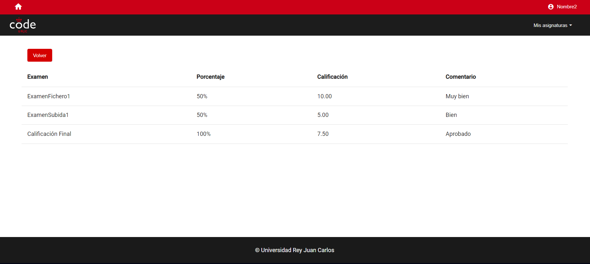

# TFG-Brais

## Índice

- [Introducción](#introducción)
- [Guía de uso](#guía-de-uso)
  - [Común a todos los usuarios](#común-a-todos-los-usuarios)
    - [Cambio de contraseña](#cambio-de-contraseña)
    - [Cerrar sesión](#cerrar-sesión)
  - [Funciones del Administrador](#funciones-del-administrador)
    - [Crear asignatura](#crear-asignatura)
    - [Ver información de la asignatura](#ver-información-de-la-asignatura)
    - [Editar asignatura](#editar-asignatura)
    - [Borrar asignatura](#borrar-asignatura)
  - [Funciones del Profesor](#funciones-del-profesor)
    - [Creación y edición de exámenes](#creación-y-edición-de-exámenes)
    - [Importación de exámenes](#importación-de-exámenes)
    - [Exportación de exámenes](#exportación-de-exámenes)
    - [Ver entregas](#ver-entregas)
    - [Ver calificaciones](#ver-calificaciones)
  - [Funciones del alumno](#funciones-del-alumno)
    - [Realizar exámenes](#realizar-exámenes)
    - [Ver calificaciones](#ver-calificaciones)
  - [Conexión con Moodle](#conexión-con-moodle)
- [Guía de despliegue](#guía-de-despliegue)
    - [Crear una imagen de docker](#crear-una-imagen-de-docker)
    - [Desplegar la imagen de docker](#desplegar-la-imagen-de-docker)
- [Documentación de desarrollo](#documentación-de-desarrollo)
  - [Diagrama de las entidades de la base de datos](#diagrama-de-las-entidades-de-la-base-de-datos)
  - [Diagrama de clases del backend](#diagrama-de-clases-del-backend)
  - [Documentación de la api rest](#documentación-de-la-api-rest)

## Introducción

Esta aplicación es un aula virtual pensada para realizar exámenes y que sean corregidos automáticamente por una inteligencia artificial.

## Guía de uso

### Común a todos los usuarios

#### Cambio de contraseña

Todos los usuarios pueden cambiar su contraseña. Para cambiar la contraseña hay que seleccionar la opción para seleccionar la contraseña de la barra de navegación. En la página de cambio de contraseña tienes que rellenar los campos de contraseña y repetir contraseña. Estos no pueden ser nulos, deben tener una longitud superior a 8 caracteres y deben ser iguales.


#### Cerrar sesión

Todos los usuarios pueden cerrar sesión. Para cerrar la sesión hay que seleccionar la opción de logout de la barra de navegación.

### Funciones del Administrador

El admin puede hacer lo que pueden hacer los usuarios comunes. Además pueden crear asignaturas, ver información de las asignaturas, editar asignaturas y borrar asignaturas.

#### Crear asignatura

Para crear una nueva asignatura hay que pulsar el botón nueva asignatura de la página principal. La nueva asignatura debe tener un nombre único (distinto a todas las existentes).
Se deben elegir a los profesores y los alumnos. Las asignaturas pueden crearse sin profesores y sin alumnos pero nunca sin nombre. Un usuario seleccionado como profesor no puede ser seleccionado como alumno y viceversa.


#### Ver informacion de la asignatura

Para ver la información de la asignatura hay que pulsar el icono del ojo respectivo a la asignatura en la página principal. Se puede ver el nombre de la asignatura y los profesores y estudantes asignados.


#### Editar asignatura

Para editar la asignatura hay que pulsar el icono del lápiz respectivo a la asignatura en la página principal. Se puede editar el nombre de la asignatura y los profesores y alumnos asignados con las mismas restricciones que para la creación de las asignaturas.


#### Borrar asignatura

Para borrar una asignatura hay que pulsar el icono de la papelera respectivo a la asignatura en la página principal.


### Funciones del Profesor

El profesor puede hacer lo que pueden hacer los usuarios comunes. El profesor puede realizar actividades relacionadas con la creación y edición de exámenes, calificación de exámenes e importación de exámenes.

#### Creación y edición de exámenes

La creación y edición de exámenes son básicamente iguales. Para crear un examen hay que pulsar el botón "Nuevo Examen" y para editar un examen hay que ir a la pantalla correspondiente al examen y pulsar el botón de "Editar".

Existen dos tipos de examen, los que consisten en preguntas cortas y los que consisten en la subida de un fichero. Estos son prácticamente iguales en las opciones de creación y edición que ofrecen pero tienen ciertas diferencias que se explicarán más tarde.

Para crear el examen, primero hay que rellenar el campo del nombre, este no puede ser vacío o igual que el de otro examen de la asignatura. También hay que seleccionar cúal es el porcentaje que contará el examen para la nota final.

El próximo campo a rellenar será el de selección del tipo de examen. Como comentamos antes, hay 2 tipos:

Fichero: se corresponde con un examen en el que el alumno tendrá que subir un archivo.

Preguntas cortas: en este tipo de examen los alumnos tienen que contestar una serie de preguntas cortas.

El apartado de selección de visibilidad del examen se refiere a si el alumno podrá ver el examen.

El apartado de selección de visibilidad de la nota se refiere a si el alumno podrá ver la nota cuando el examen ya está calificado.

El apartado de entregas tardías se refiere a si los alumnos podrán realizar entregas del examen una vez haya pasado el plazo.

Si se ha elegido la opción de examen de tipo subida de fichero habrá otra opción para seleccionar si el alumno puede subir un fichero aunque ya haya subido uno anterior.

Si se ha elegido la opción de examen de tipo de preguntas cortas habrá una opción para seleccionar el tiempo que tendrá el alumno para realizar el examen.

El apartado de selección de fechas y horas se refieren a cuando se abrirá el examen y cuando se cerrará el examen. La fecha de apertura debe ser anterior a la de cierre, y ambas nunca deben ser anteriores a la fecha actuál.

La opción para subir enunciado se usa para que el profesor pueda subir un fichero con cuestiones relacionadas con el examen.

Si se ha seleccionado la opción de un examen de preguntas cortas se abrirá una opción para establecer las preguntas. El número de preguntas debe ser superior a cero. Cada pregunta debe tener un enunciado y una puntuación.


#### Importación de exámenes

Se pueden importar exámenes de otras plataformas para que sean corregidos por la plataforma. Solamente se pueden importar exámenes de preguntas cortas de otras plataformas.

Para importar exámenes hay que seleccionar el botón de "Importar Examen" en la pantalla principal de la asignatura.

En la pantalla de importación de exámenes hay que seleccionar los mismos campos que para la creación de un examen de preguntas cortas, salvando el apartado de preguntas cortas que son importadas directamente. Hay un nuevo apartado para subir el fichero del que se va a importar. Cuando se importa un examen, se registra al alumno en caso de que no esté registrado (la contraseña establecida es el nombre del alumno seguido del apellido del alumno, ej: Alumno1 Apellido1 Apellido2 su contraseña sería Alumno1Apellido1 Apellido2).


#### Exportación de exámenes

Los exámenes de preguntas cortas se pueden exportar para ser importados en otras plataformas. Para exportarlos hay que pulsar el botón "Exportar Examen" en la página principal del examen correspondiente.

#### Ver entregas

Los profesores pueden ver las entregas que han hecho los alumnos. Para esto tienen que pulsar el botón "Ver Entregas" en la página principal del examen.

En las entregas se puede ver el nombre del alumno, la fecha de entrega si se ha entregado y la calificación si ha sido calificado.


El profesor puede realizar distintas acciones:

Descargar la entrega: se debe pulsar el icono de la flecha para abajo correspondiente a la entrega.

Ver la entrega: esta opción solo está disponible si el examen es de preguntas cortas. En ella se pueden ver las respuestas y la calificación de cada pregunta en caso de haberla.


Borrar la entrega: esta opción sirve para borrar la entrega del alumno.

Calificar o editar la calificación: si no se ha calificado la entrega se podrá pulsar el botón para calificar, en caso de que haya sido calificada el botón servirá para editar la calificación. Si el examen es de preguntas cortas hay que calificar cada pregunta, si es de subida de fichero hay que calificar la entrega. En ambos casos se puede establecer un comentario sobre la tarea.


#### Ver Calificaciones

Los profesores pueden ver todas las calificaciones que han obtenidos todos los alumnos de las asignaturas. A esta pantalla se puede acceder pulsando el botón "Calificaciones" de la pantalla principal de la asignatura.


### Funciones del alumno

Los alumnos pueden hacer lo que pueden hacer los usuarios comunes. Los alumnos pueden realizar exámenes y ver sus calificaciones.

#### Realizar exámenes

Los alumnos pueden realizar los exámenes de preguntas cortas, para ello tienen que pulsar el botón realizar entrega en la página principal del examen. Se le redirigirá a la pantalla para realizar el examen, en ella se le mostrarán las preguntas, su valor y el tiempo necesario. Una vez realizado si el profesor lo ha elegido así podrá ver las respuestas y si ha sido calificado ver la calificación de cada pregunta.


Para realizar la entrega de un examen de subida de fichero es similar solo que hay que en ese caso se pide que se suba un fichero. En este caso podrá descargar su entrega.


#### Ver calificaciones

Los alumnos pueden ver las calificaciones que han obtenido en la asignatura. Para ello debe pulsar en el botón "Mis Calificaciones" de la página principal de la asignatura.



### Conexión con Moodle

Para conectar la aplicación con Moodle lo primero que hay que hacer es tener un par de claves pública y privada RSA de 2048 bits. En la siguiente página se puede hacer: https://www.devglan.com/online-tools/rsa-encryption-decryption.

En Moodle tenemos que configurar una nueva herramienta. Para esto tenemos que ir a la administración de plugins y añadir una nueva herramienta externa. Tenemos que seleccionar la opción para configurar una herramienta manualmente.


Una vez hemos entrado en la pantala de configuración, tenemos que establecer el nombre que le vamos a dar la herramienta, así como su URL de lti (url_plataforma/lti/). En la versión de LTI tenemos que seleccionar la 1.3 y en el tipo de clave pública RSA. En el apartado de clave pública tenemos que escribir la clave pública que hemos generado, en formato PEM, esto es, la clave debe empezar con -----BEGIN PUBLIC KEY-----
y terminar con
-----END PUBLIC KEY-----.
Un ejemplo de clave sería:
-----BEGIN PUBLIC KEY-----
MIIBIjANBgkqhkiG9w0BAQEFAAOCAQ8AMIIBCgKCAQEAhH42c/dsiVm+/ppuHVf6SpOVqIyeUs9LYVa33cyoeT9UfXyQIDXgjkAFbx19bsiilPMRFWmEfBcvjROTX3hJGFxgLEWVNJR9Ij/UO+bb5eyI49dGK9Lyl7fmkphdtjmew+K0yfe32t6/dz8snRz5+lo9OOeGNEMEG2noMSWF3O6kpdTNo589nHvf3DB1UWSXwphsQgdWN8+JVDe1Ty4udD4xhypZRMB5lDAo8XyVUkpg5OslvoZweRgjxHyE5y5b9aalziax1nqULTRqn+l8DAhFJIQx7SxNpaq9evJ9kmAyI2wkW0D5zHcx/PGhBvkeE8chU2NGYY7YmyQRKyO9rwIDAQAB
-----END PUBLIC KEY-----

En el apartado de initiate login url tenemos que poner la URL de la plataforma + /lti/login (url_plataforma/lti/login) y en la de Redirection Url la misma que arriba de todo. En el Default Launch Container debemos seleccionar en una nueva ventana. Y en el apartado de privacidad tenemos que establecer las opciones de intercambio de datos y de aceptación de notas a siempre. En servicios debe quedar como en la foto, permitiendo usar todos los servicios.


Una vez hemos configurado la plataforma en Moodle tenemos que modificar el archivo Backend\src\main\resources\application.properties para cambiar los siguientes campos teniendo en cuenta la información que nos aporta Moodle. Tenemos que cambiar los siguientes apartados del archivo:
lti.clientId: lo cambiamos por el Deployment ID que nos aporta Moodle.
lti.externalPlatform: lo cambiamos por el Platform ID que nos aporta Moodle.
lti.keySetUrl: lo cambiamos or el Public Keyset URL que nos aporta Moodle.
lti.accessTokenUrl: lo cambiamos por el Access Token URL que nos aporta moodle.
lti.oidcAuthUrl: lo cambiamos por Authentication request URL.
lti.privateKey: lo cambiamos por la clave privada generada anteriormente.
lti.publicKey: lo cambiamos por la clave pública generada anteriormente.
lti.deploymentId: lo cambiamos por el Deployment ID que nos aporta Moodle.

Debemos tener algo similar a lo siguiente:

```Java
lti.basic.registration.id=1
lti.clientId=gLdbMIPatorTZvl
lti.name=Aula Virtual
lti.externalPlatform=http://localhost
lti.keySetUrl=http://localhost/mod/lti/certs.php
lti.accessTokenUrl=http://localhost/mod/lti/token.php
lti.oidcAuthUrl=http://localhost/mod/lti/auth.php
lti.algorithm=RSA
lti.privateKey=MIIEvAIBADANBgkqhkiG9w0BAQEFAASCBKYwggSiAgEAAoIBAQCXie8Sm3TWI2Q1RjI7KboATZxPNGkg667UZnE48Iv3w8vQ5DMqYvPnoDuArakugYw6iMhnlmk1lkrS6L5JqbmEGVNVPSp2JZyxxM35UQxn0Y1wlNbZYMOzQP8CPxtdoB12+8zqA0DU8g+/8Bswz93gLimfJuhpWzCT0065XbLWmMduMT1r2N08oEvDKjFNv6pM7V+89dmc2nnCaNi0OillKtSNyr0OxzjKi7BHVRmXCNbMGTsZEU9Tre4AC53KQYAIa4ANRjCOBzHU4LP6JXNQDF4GcXK/g55t83phHgxP7kbxvcKstOeJqau4ds6hqQt7wvl0FrNVtUa/AgFwMy/bAgMBAAECggEAT50Q9EamAGbBm9eQRlLqvIQJzfbsEHah+EcFzvNZpcbBCrMJSoiIObWN7VHPY3Z+NLZuCzYTeirGjr3mUw8PPx6LEGo9J6slAqQxzn1NNjH6zB32LmhPCJrqHsUG3I5lTICHrJ4e7oFp0t4TevaKS+AUz9+CFO/quo82ed6HOYRgx+3cWzQI5O9NN083OaK9T5qIM+BK8cyjucFKBxy4M45Ye9Vrzfn3HeYbEMKGR4pkeRQPhD6rz1YcWvzIOc6QgvZ0kAXH1cqN14Wk0V0VOIepHgD5HaISmRIfQZD/9Vy/RqAyFl5YKW559ionOYcteGmBMk9zBN1V33cvliGm+QKBgQD04VPuOyl82IRMG75jV2UynzA+OXOPx1S6ba7cNdlcm7HZOwxAJI/0kPbyK7ubKwFXjMRKljthubSYNDlfj8CB8rbPVPDMnLqPoaPJZtT29W5T/Rz42enfpea8pI921LZ0kp9vBriY4GnXsMIIcFA5qkGIilFThJwuz8qshWzpbQKBgQCea4kLZ0GYfVP2RCp7kSVwuWfdrgEvhTYAWx7iDwYLRwiToZKGyxRC1edTQC0akTrWNJ0ff7+oz7GO8xPwRiBoTLBnXHg3vmU1o4j16fyeyBnYPP0iau8TrM82eJNNJFckL27rKGrZavIEMLe3Mss3jJ56cGE4YNyUpz5MTgg5ZwKBgCiv26skh1MoAmtG3M5SsgzEKFbeYtYLz4cePER4agIaGGW4iuOJb6W6BF3eaFByx8lNKTwfVAR7v4befn3jO6AbvMYcHdpRXCoLOFR5Un8p7kfkMVEjm9k+DmVfjjq3Qw2BYx4mZrt35f4hb0vJpXq/UB4opTSUPwMEIW+ix6LNAoGAPDWKpHbeC2K2ooZNzyDfJfSRcUNM2A68822uUyR6m5anv9RMqEZOsQgzHwTpH4vK3NaqUOpwoWwug7IHBe7hKkLbWK1gU29dcAFzcGM5y+8pQ3IKkyYpL0UijAVPlqYVKH+OnHmEApYO3WDWsh3v9nDPWqGTkaXer/DQUJfnsEkCgYBI1wIANAL3FJqcidUMV4lCmWsDi4wHbVeWkU2SA2O7/1imxmT5t86ZKm31YfSv1exLCk1sts3rrNhCdhOPspqZaW8EpNEhV9POtaP5OFKO3HexZQxh29cGp8gT2jj3R2+BIH76q5dwrEoUFK/cXNF04BZ3o0IJpIy9QYXpBuuCWg==
lti.publicKey=MIIBIjANBgkqhkiG9w0BAQEFAAOCAQ8AMIIBCgKCAQEAl4nvEpt01iNkNUYyOym6AE2cTzRpIOuu1GZxOPCL98PL0OQzKmLz56A7gK2pLoGMOojIZ5ZpNZZK0ui+Sam5hBlTVT0qdiWcscTN+VEMZ9GNcJTW2WDDs0D/Aj8bXaAddvvM6gNA1PIPv/AbMM/d4C4pnyboaVswk9NOuV2y1pjHbjE9a9jdPKBLwyoxTb+qTO1fvPXZnNp5wmjYtDopZSrUjcq9Dsc4youwR1UZlwjWzBk7GRFPU63uAAudykGACGuADUYwjgcx1OCz+iVzUAxeBnFyv4OebfN6YR4MT+5G8b3CrLTniamruHbOoakLe8L5dBazVbVGvwIBcDMv2wIDAQAB
lti.deploymentId=18
```


Una vez hecho esto ya podemos levantar la aplicación. En Moodle, en la asignatura en cuestión el profesor tendrá que crearuna nueva actividad del tipo Herramienta Externa. En ella hay establecer un nombre para la actividad. Hay que ir al apartado de más configuración y en custom parameters tenemos que poner 2 parámetros, el primero exam_name con el nombre del examen de la aplicación y el segundo subject_name con el nombre de la asignatura en la aplicación. Una vez hecho esto vamos al apartado de herramientas preconfiguradas y seleccionamos nuestra herramienta, cuando esté listo, le damos a crear y se nos creará la actividad.


Si nuestro correo estaba asociado a una cuenta en la aplicación se iniciará sesión, en caso contrario se creará una cuenta y se iniciará sesión. Si el examen no estaba todavía creado o la asignatura no existe se registrará igualmente pero saldrá un error. En caso de que el examen no esté creado solo necesitamos logearnos, con nuestro correo y la contraseña (en caso que no estuvieramos registrados será nuestro Nombre y Apellidos sin espacios entre Nombre y Apellidos, ej: Nombre1 Apellido1 Apellido2 la contraseña sería Nombre1Apellido1 Apellido2) tenemos que ir a la asignatura y crear el examen. El examen se crea con normalidad y con el nombre que le hemos puesto de parámetro a Moodle. Los alumnos cuando accedan através de la URL de Moodle se registrarán de igual manera que hace el profesor.

Una vez ya se haya realizado el examen el profesor puede darle al botón de "Subir Calificaciones al LMS" para subir las calificaciones a Moodle.

## Guia de despliegue

### Crear una imagen de docker

Para crear la imagen de docker hay que ejecutar el script "createImage.sh" de la carpeta Docker. Para ejecutar el script hay que pasarle obligatoriamente un parámetro con el username de docker y otro con el nombre de la imagen. Opcionalmente se le puede pasar un parámetro con la etiqueta de la imagen.

```shell
cd Docker
./createImage.sh braiscabo tfg latest
```

### Desplegar la imagen de docker

Para desplegar la imagen que hemos creado hay que ejecutar el script "deployImage.sh" de la carpeta Docker. Para ejecutar el script hay que pasarle 2 parámetros, el nombre de la imagen (el nombre se refiere a nombre de ususario y nombre de la imagen ej: nombreUsuario/nombreImagen) y otro con la etiqueta de la imagen.

```shell
cd Docker
./deployImage.sh braiscabo/tfg latest
```

## Documentación de Desarrollo

### Tecnologías usadas

Para este proyecto se ha utilizado Spring Boot 3.1 para crear el backend. Para el frontend se ha usado Angular 16.0.4. Para empaquetar la aplicación se ha utilizado docker.

### Diagrama de las entidades de la base de datos


### Diagrama de clases del backend


### Documentación de la api rest

Las documentación de la Api Rest se encuentra en el archivo: Backend\api-documentation.pdf